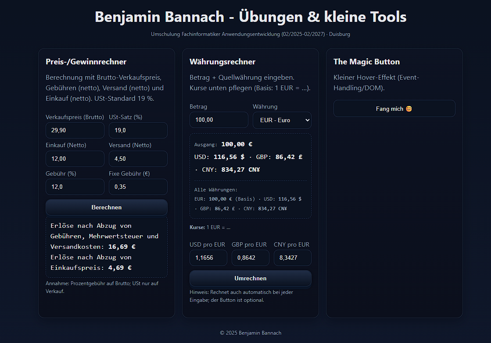

# Portfolio Website

Kleine Portfolio-Seite mit Beispielen aus meiner Umschulung zum Fachinformatiker Anwendungsentwicklung (2025–2027).  
Die Seite ist mit **HTML, CSS und JavaScript** umgesetzt und enthält erste praktische Mini-Projekte.

**Live-Demo:** [GitHub Pages ansehen](https://<DEIN-USERNAME>.github.io/Portfolio-Website/)

---

## Inhalte

- **Preis-/Gewinnrechner**  
  Berechnet Nettoerlöse nach Abzug von Gebühren, Versand, Einkauf und Mehrwertsteuer.  
  Praxisnahes Beispiel aus dem E-Commerce.

- **Währungsrechner**  
  Umrechnung zwischen EUR, USD, GBP und CNY.  
  Wechselkurse können manuell angepasst werden.  
  Typische Aufgabe im Import/Handel.

- **Button-Demo (Fun-Interaktion)**  
  Einfaches Event-Handling mit DOM-Manipulation.

---

## Ziel

Die Seite dient als **Übungs- und Vorzeigeprojekt**:  
- erste Schritte mit Frontend-Technologien (HTML/CSS/JS)  
- saubere Struktur und Kommentare  
- praxisnahe Aufgaben aus E-Commerce- und Alltagskontext

---

## Technologien

- HTML5 & CSS3 (Flex/Grid, Responsive Design, Dark Theme)
- JavaScript (DOM-Manipulation, Event-Handling, Rechenlogik)
- Git & GitHub (Versionierung, Deployment via GitHub Pages)

---

## Geplante Erweiterungen

- Preset-Button für aktuelle Wechselkurse
- Light/Dark Mode Umschalter
- weitere kleine JS-Demos (Formularvalidierung, Passwortgenerator)

---

## Screenshot

  
*(Screenshot folgt – kann noch ergänzt werden.)*

---

## Kontakt

Benjamin Bannach  
📧 benjamin.bannach.dev@gmail.com
📍 Region Ruhrgebiet (Duisburg / Düsseldorf / Essen)
